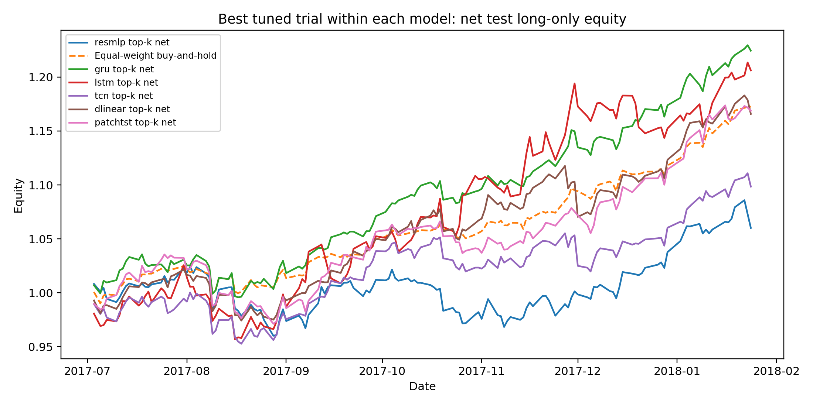
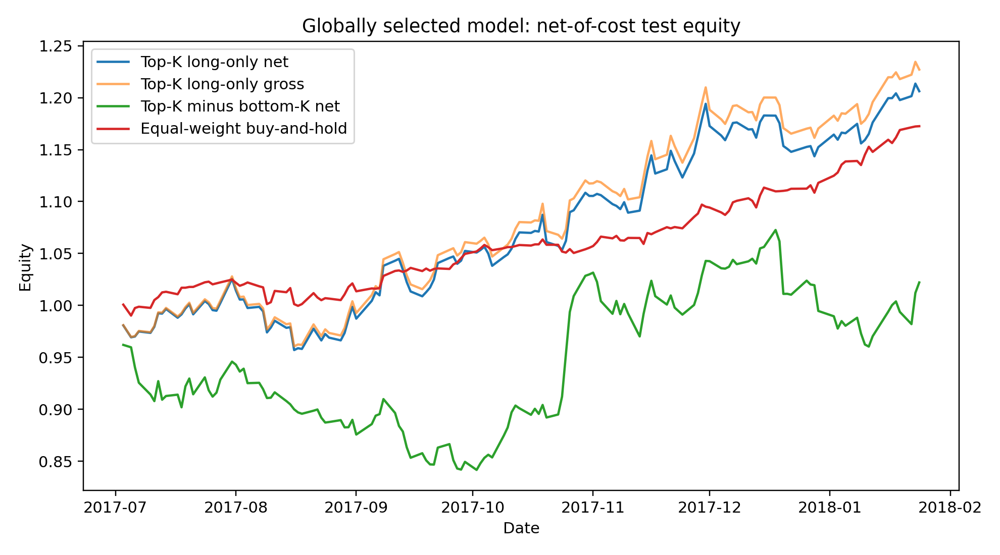

# Deep Sequential Models for Cross-Sectional Stock Selection

A course-project-ready deep learning alpha research pipeline for **cross-sectional stock selection** on S&P 500 daily OHLCV data.

The goal is not to claim a tradable arbitrage strategy. This repository is intended to demonstrate a realistic research workflow: feature engineering, cross-sectional ranking labels, IC evaluation, transaction-cost-aware backtesting, turnover control, model comparison, and multi-seed robustness checks.

> **Disclaimer.** This project is for educational and research purposes only. It is not financial advice and should not be used as a live trading system without substantial additional validation.

## Project paper

A short project paper is available here: [deep-learning-stock-alpha.pdf](deep-learning-stock-alpha.pdf).
A presentation beamer-based PDF is available here: [StockDL_ppt_en.pdf](StockDL_ppt_en.pdf).


## Main features

- Converts price prediction into **cross-sectional stock ranking**.
- Supports IC-aware and pairwise ranking losses: `smoothl1`, `smoothl1_ic`, `smoothl1_pairwise`, and `smoothl1_ic_pairwise`.
- Compares `ResMLP`, `GRU`, `LSTM`, `TCN`, `DLinear`, and `PatchTST`-style models.
- Runs net-of-cost long-only and long-short backtests with turnover measurement.
- Supports score smoothing, equal-weight and inverse-volatility portfolios, and simple model ensembles.
- Provides a multi-seed runner with aggregated report tables.

## Main results

The following table summarizes the cross-sectional stock selection results over three random seeds. All portfolio returns are net of 5 bps transaction costs. The equal-weight buy-and-hold benchmark return is **17.25%**, and its Sharpe ratio is **4.0497**.

| Model | Test IC | Long-only return | Excess return | Long-short return | Sharpe | Turnover |
|---|---:|---:|---:|---:|---:|---:|
| DLinear | $0.0234\pm0.0107$ | $9.83\%\pm9.05\%$ | $-7.42\%\pm9.05\%$ | $-0.23\%\pm13.62\%$ | $1.4826\pm1.3715$ | $0.2218\pm0.0343$ |
| Ensemble | $\mathbf{0.0512\pm0.0180}$ | $18.25\%\pm7.76\%$ | $1.00\%\pm7.76\%$ | $5.30\%\pm4.68\%$ | $2.0211\pm0.8886$ | $0.2087\pm0.0573$ |
| GRU | $0.0270\pm0.0441$ | $21.51\%\pm10.28\%$ | $4.25\%\pm10.28\%$ | $2.70\%\pm11.69\%$ | $\mathbf{3.5275\pm1.7344}$ | $\mathbf{0.1057\pm0.0399}$ |
| LSTM | $0.0272\pm0.0134$ | $19.66\%\pm6.13\%$ | $2.40\%\pm6.13\%$ | $0.30\%\pm7.90\%$ | $3.1604\pm1.2997$ | $0.1201\pm0.0806$ |
| PatchTST | $0.0496\pm0.0108$ | $\mathbf{25.42\%\pm4.68\%}$ | $\mathbf{8.17\%\pm4.68\%}$ | $6.85\%\pm16.47\%$ | $3.3560\pm0.5511$ | $0.1945\pm0.0695$ |
| ResMLP | $0.0395\pm0.0176$ | $17.22\%\pm2.21\%$ | $-0.04\%\pm2.21\%$ | $1.23\%\pm2.72\%$ | $2.9712\pm0.4244$ | $0.3452\pm0.1156$ |
| TCN | $0.0311\pm0.0101$ | $22.71\%\pm8.35\%$ | $5.46\%\pm8.35\%$ | $\mathbf{11.54\%\pm11.67\%}$ | $3.0431\pm1.1644$ | $0.2364\pm0.0281$ |

<p align="center">
  
  
</p>


## Repository structure

```text
.
├── README.md
├── deep-learning-stock-alpha.pdf  # project paper for reading
├── StockDL_ppt_en.pdf             # presentation slides
├── LICENSE
├── requirements.txt
├── figures/
│   ├── best_by_model_equity_curve.png
│   └── best_equity_curve.png
├── data/
│   └── raw/
│       └── .gitkeep              # put all_stocks_5yr.csv here after downloading from Kaggle
└── src/
    ├── check_gpu.py
    ├── train_alpha.py
    ├── run_multi_seed.py
    ├── run_additional_experiments.py
    ├── collect_ablation_results.py
    ├── copy_figures_for_report.py
    └── stock_alpha_dl/
        ├── backtest.py
        ├── data.py
        ├── dataset.py
        ├── features.py
        ├── models.py
        └── training.py
```

## Data

Raw market data is **not included** in this repository. Please download it from Kaggle before running the experiments. The code expects the consolidated S&P 500 daily price file at:

```text
data/raw/all_stocks_5yr.csv
```

The expected CSV format is the public Kaggle S&P 500 stock dataset format, with columns such as `date`, `open`, `high`, `low`, `close`, `volume`, and `Name`/`ticker`.

### Option A: download from the Kaggle website

1. Open Kaggle and search for **S&P 500 stock data** by `camnugent`, or go to the dataset page `camnugent/sandp500`.
2. Download and unzip the dataset.
3. Copy `all_stocks_5yr.csv` into `data/raw/all_stocks_5yr.csv`.

On Windows PowerShell:

```powershell
New-Item -ItemType Directory -Force .\data\raw
Copy-Item .\path\to\all_stocks_5yr.csv .\data\raw\all_stocks_5yr.csv
```

On Linux/macOS:

```bash
mkdir -p data/raw
cp /path/to/all_stocks_5yr.csv data/raw/all_stocks_5yr.csv
```

### Option B: download with the Kaggle CLI

Install and configure the Kaggle CLI first. You need a Kaggle account and a local `kaggle.json` API token. Then run:

```bash
pip install kaggle
mkdir -p data/raw
kaggle datasets download -d camnugent/sandp500 -p data/raw --unzip
```

After downloading, confirm that the file exists:

```bash
ls data/raw/all_stocks_5yr.csv
```

On Windows PowerShell, the same download command works after Kaggle CLI authentication:

```powershell
New-Item -ItemType Directory -Force .\data\raw
kaggle datasets download -d camnugent/sandp500 -p data/raw --unzip
Test-Path .\data\raw\all_stocks_5yr.csv
```

## Installation

Python 3.10 or 3.11 is recommended.

```powershell
# Windows PowerShell
python -m venv .venv
.\.venv\Scripts\Activate.ps1
python -m pip install --upgrade pip
pip install -r requirements.txt
```

On Linux/macOS:

```bash
python -m venv .venv
source .venv/bin/activate
python -m pip install --upgrade pip
pip install -r requirements.txt
```

Check whether PyTorch can see a GPU:

```bash
python src/check_gpu.py
```

## Recommended final experiment

Use `--device auto` for portability. If CUDA is available and PyTorch is installed with CUDA support, you can change it to `--device cuda --amp`.

```bash
python src/run_multi_seed.py \
  --source local \
  --csv-path data/raw/all_stocks_5yr.csv \
  --experiment-name alpha_v5_h10_ensemble \
  --seeds 0 1 2 \
  --preset quick \
  --models resmlp gru lstm tcn dlinear patchtst \
  --trials 12 \
  --epochs 10 \
  --transaction-cost-bps 5 \
  --horizons 10 \
  --loss smoothl1_ic \
  --objective val_alpha_combo \
  --score-emas 1.0 0.7 0.5 \
  --portfolio-weightings equal inv_vol \
  --enable-ensemble \
  --ensemble-models lstm resmlp patchtst \
  --ensemble-top-frac 0.05 \
  --ensemble-score-ema 0.7 \
  --device auto
```

For a smaller core run:

```bash
python src/run_multi_seed.py \
  --source local \
  --csv-path data/raw/all_stocks_5yr.csv \
  --experiment-name alpha_v5_core \
  --seeds 0 1 2 \
  --preset quick \
  --models lstm resmlp patchtst tcn \
  --trials 10 \
  --epochs 8 \
  --transaction-cost-bps 5 \
  --horizons 10 \
  --loss smoothl1_ic \
  --objective val_alpha_combo \
  --enable-ensemble \
  --device auto
```

## Output structure

Multi-seed outputs are saved under:

```text
experiments/<experiment-name>_<timestamp>/
├── seed_0/
├── seed_1/
├── seed_2/
└── summary/
    ├── model_comparison_all_seeds.csv
    ├── model_comparison_mean_std.csv
    ├── model_comparison_mean_std_pretty.csv
    ├── model_comparison_mean_std_latex.tex
    ├── best_model_by_seed_test_excess.csv
    ├── cost_sensitivity_all_seeds.csv
    └── cost_sensitivity_mean_std.csv
```

Use `summary/model_comparison_mean_std_pretty.csv` as the main report table.

## Suggested report title

**Deep Sequential Models for Cross-Sectional Stock Selection: Ranking Losses, Transaction Costs, and Portfolio Construction**

中文题目：**基于深度时序模型的横截面股票选择：排序损失、交易成本与组合构建的实证研究**

## Reproducibility notes

- The default chronological split is controlled by `--train-end` and `--val-end`.
- Random seeds are controlled by `--seed` in `train_alpha.py` and by `--seeds` in `run_multi_seed.py`.
- The smoke test validates that the repository can load the Kaggle CSV after it has been placed under `data/raw/`, create features, train a small model, backtest, and save outputs.
- Full experiment results depend on hardware, PyTorch version, and whether CPU or GPU is used.

## License

This project is released under the MIT License. See [LICENSE](LICENSE) for details.
